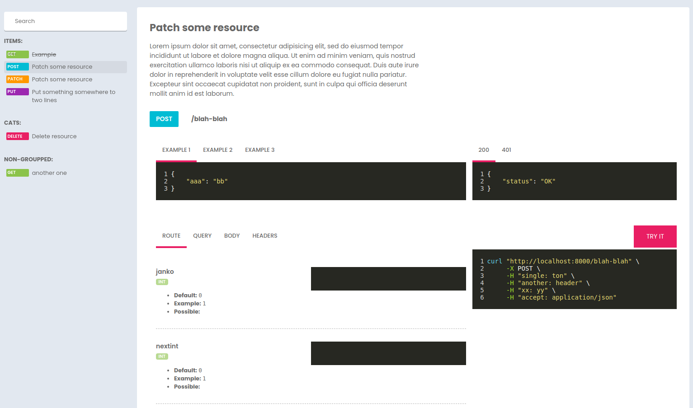

# Laravel API documentation generating tool


### The problem
I don't like writing tons of lines of stupid annotations just to have hope that api documentation will be generated correctly without errors that says nothing. And I am not the only one. [More](WHY.md).

This package solves this problem the way I like - by writing PHP code.

### The solution

This package adds `apidocs` method to [Laravel](https://github.com/laravel/laravel) routes, where you can define route definitions using code you use every day.

**This way you can:**
 - reuse, extend and modify existing api definitions
 - create generic endpoint definitions and just modify them ad-hoc or by creating child classes
 - define multiple examples
 - define multiple sample responses
 - define and reuse parameter definitions
 - make your controllers readable again




## Getting started

 1. Add `johnylemon/laravel-apidocs` repository

```
composer require johnylemon/laravel-apidocs
```

2. Register `Johnylemon\Apidocs\Providers\ApidocsServiceProvider` provider if not registered automagically .


3. Install package. This command will publish all required assets.
```
php artisan apidocs:install
```

4. **Enjoy!**


## Generating route documentation

This package ships with command for rapid route definition generation.

```
php artisan apidocs:endpoint SampleEndpoint
```
Brand new `SampleEndpoint` class will be placed within `app\Apidocs\Endpoints` directory.
Target directory may be changed within your `apidocs` config file.

This class contains only one `describe` method, where you have to use any of available methods that will describe your endpoint. Like that:

```php
<?php

namespace App\Apidocs\Endpoints;

use Johnylemon\Apidocs\Endpoints\Endpoint;
use Johnylemon\Apidocs\Facades\Param;

class SampleEndpoint extends Endpoint
{
    public function describe(): void
    {
        $this->title('List users')
            ->desc('Returns paginated list of users');
    }
}

```

As you can see we set title and description as endpoint definition.
Every [method](#endpoint-available-methods) returns endpoint instance so you can chain them.


### <a name="endpoint-available-methods"></a> Endpoint available methods

- [uri](#endpoint-uri)
- [method](#endpoint-method)
- [group](#endpoint-group)
- [deprecated](#endpoint-deprecated)
- [title](#endpoint-title)
- [description](#endpoint-description)
- [desc](#endpoint-desc)
- [query](#endpoint-query)
- [params](#endpoint-params)
- [body](#endpoint-body)
- [header](#endpoint-header)
- [headers](#endpoint-headers)
- [example](#endpoint-example)
- [examples](#endpoint-examples)
- [returns](#endpoint-returns)


#### <a name="endpoint-uri"></a> uri
Set uri. Called under the hood during endpoint mounting
```php
$this->uri('/users');
```

#### <a name="endpoint-method"></a> method
Set endpoint method. Called under the hood during endpoint mounting
```php
$this->method('POST');
```

#### <a name="endpoint-group"></a> group
Add endpoint to specific [group](#groups). Group have to be defined previously.
```php
$this->group('some-group-slug');
```

#### <a name="endpoint-deprecated"></a> deprecated
Will mark endpoint as deprecated.
```php
$this->deprecated();
```

#### <a name="endpoint-title"></a> title
Set endpoint title
```php
$this->title('Create user resource');
```

#### <a name="endpoint-description"></a> description
Set endpoint description
```php
$this->description('This endpoint contains logic for creating user resources based on provided data');
```

#### <a name="endpoint-desc"></a> desc
Alias for [description](#desc)

#### <a name="endpoint-query"></a> query
Defines endpoint query params. See: [parameters](#parameters)

```php
$this->query([
    'page' => Param::type('int')
])
```

#### <a name="endpoint-params"></a> params
Defines endpoint route params. See: [parameters](#parameters)

```php
$this->query([
    'page' => Param::type('int')
])
```

#### <a name="endpoint-body"></a> body
Defines endpoint body params. See: [parameters](#parameters)

```php
$this->query([
    'page' => Param::type('int')
])
```

#### <a name="endpoint-header"></a> header
Defines endpoint header

```php
$this->header('x-johnylemon', 'apidocs')
```

#### <a name="endpoint-headers"></a> headers
Defines multiple endpoint header at once

```php
$this->headers([
    'x-johnylemon' => 'apidocs',
    'x-laravel' => 'framework'
])
```

#### <a name="endpoint-example"></a> example
Defines endpoint example. Optionally you can define example title

```php
$this->example([
    'name' => 'johnylemon',
    'web' => 'https://johnylemon.dev',
    'email' => 'hello@johnylemon.dev'
], 'Store user')
```

#### <a name="endpoint-examples"></a> examples
Define multiple endpoint examples at once

```php
$this->examples([
    [
        'name' => 'johny',
        'web' => 'https://johnylemon.dev',
        'email' => 'hello@johnylemon.dev'
    ],
    [
        'name' => 'lemon',
        'web' => 'https://johnylemon.dev',
        'email' => 'hello@johnylemon.dev'
    ]
])
```

#### <a name="endpoint-returns"></a> returns
Define sample return value with status code. OPtinally you may define response description.

```php
$this->returns(201, [
    'name' => 'johny',
    'web' => 'https://johnylemon.dev',
    'email' => 'hello@johnylemon.dev'
], 'User created')
->returns(401, [
    'status' => 'unauthorized',
], 'Auth issue');
```

Additionally you can use methods like `returns201` (or any other status code)
```php

// calling this ...
$this->returns201([
    'name' => 'johny',
    'web' => 'https://johnylemon.dev',
    'email' => 'hello@johnylemon.dev'
], 'User created');

// ... is equivalent of this...

$this->returns(201, [
    'name' => 'johny',
    'web' => 'https://johnylemon.dev',
    'email' => 'hello@johnylemon.dev'
], 'User created')
```

## Endpoint definition usage

Okay, you created your first endpoint definition. Now it's time to use it as some real route definition.

Lets assume you have following routes:

```php

Route::get('api/users', [UsersController::class, 'index']);
Route::post('api/users', [UsersController::class, 'store']);
Route::patch('api/users/{id}', [UsersController::class, 'update']);

```
If you want to use `App\Apidocs\Endpoints\SampleEndpoint` class as definition for first of them you should simply do this:

```php

use App\Apidocs\Endpoints\SampleEndpoint;

Route::get('api/users', [UsersController::class, 'index'])->apidocs(SampleEndpoint::class);

```

and... yes, thats it!

The only thing you have to do now is to call `php artisan apidocs:generate` command and visit `/apidocs` route to see it in action!

> :warning: **This package must clear route cache to generate apidocs properly.** If you are using route caching in your production environment rememeber to call `artisan route:cache` after `artisan apidocs:generate` command

Because `apidocs` method returns endpoint class, you can chain methods during route definition. For example, you may want to mark your route as deprecated:

```php

use App\Apidocs\Endpoints\SampleEndpoint;

Route::get('api/users', [UsersController::class, 'index'])->apidocs(SampleEndpoint::class)->deprecated();


```

And because `deprecated` method returns endpoint as well, you are allowed to use [other endpoint methods](#endpoint-available-methods).

> :warning: **After calling `apidocs` method you cannot use route-specific methods**, like, say, `name` method.
Be sure to call `apidocs` method after all framework route-specific methods are called.


## <a name="parameters"></a>Parameters

Some routes contains route parameters, like `{user}` segment.
Sometimes you also want to use required or optional query parameters.
Routes like `POST`, `PATCH`, `PUT` almost always expects some payload.

You can define them using params, and pass them as array to `query`, `body` and `params` method when describing endpoint.

Lets assume your `index` route from previously presented routes expects optional `page` parameter.

Your definition should now contain additional `query` method call with array of possible parameters. After that your code will look like that:


```php
<?php

namespace App\Apidocs\Endpoints;

use Johnylemon\Apidocs\Endpoints\Endpoint;
use Johnylemon\Apidocs\Facades\Param;

class SampleEndpoint extends Endpoint
{
    public function describe(): void
    {
        $this->title('List users')
            ->desc('Returns paginated list of users')
            ->query([
                Param::int('page')->example(1)->default(1)->optional()
            ])
    }
}

```
Note that we did not specify parameter name (`page`) by array key. It is not necessary when you define parameter name within class. But of course you can define them in different way:


```php

use Johnylemon\Apidocs\Facades\Param;

$this->query([

    // parameter name will be `page`
    Param::int('page')->example(1)->default(1)->optional()

    // same effect:
    'page' => Param::int('page')->example(1)->default(1)->optional()

    // same effect:
    'page' => Param::type('int')->example(1)->default(1)->optional()

    // this parameter will be named `page_number`
    'page_number' => Param::int('page')->example(1)->default(1)->optional()
])

```

As you can see, when parameter name is defined in both, array key and param name, array key will take precedence allowing you to create reusable [custom parameters](#custom-parameters).

Route parameters and request body parameters can be defined same way.


### Available methods

- [type](#param-type)
- [name](#param-name)
- [description](#param-description)
- [desc](#param-desc)
- [required](#param-required)
- [optional](#param-optional)
- [enum](#param-enum)
- [possible](#param-possible)
- [default](#param-default)
- [example](#param-example)
- [eg](#param-eg)


#### <a name="param-type"></a> type
Define parameter type

```php
Param::type('int');
```

#### <a name="param-name"></a> name
Define parameter name

```php
Param::name('username');
```

#### <a name="param-description"></a> description
Define parameter description

```php
Param::description('Unique username');
```

#### <a name="param-desc"></a> desc
Alias of `description`. See [description](#param-description)


#### <a name="param-required"></a> required
Mark parameter as required

```php
Param::required();
```

#### <a name="param-optional"></a> optional
Mark parameter as optional

```php
Param::optional();
```

#### <a name="param-possible"></a> possible
Set parameter possible values
```php
Param::possible([10, 100, 1000]);
```

#### <a name="param-enum"></a> enum
Alias for `possible`. See [possible](#param-possible)
```php
Param::enum([10, 100, 1000]);
```


#### <a name="param-default"></a> default
Set parameter default value.

```php
Param::default(42);
```

#### <a name="param-example"></a> example
Set parameter example.

```php
Param::example(42);
```


#### <a name="param-eg"></a> eg
Alias for `example`. See [example](#param-example)

Param class makes use of magic `__call` method and allow you to define parameter type and name at once by using one of these methods: `string`, `array`, `boolean`, `bool`, `integer` or `int`

```php

use Johnylemon\Apidocs\Facades\Param;

$this->query([
    Param::string('slug'), // `slug` property, that should have `string` type
    Param::int('id'), // id `property`, that should have `int` type
    Param::array('roles'), // `roles` property, that should have `array` type
])

```

### <a name="custom-parameters"></a> Custom parameters

It is common case that you may use `page` or some other param in different endpoint definitions. So it may be cumbersome to write something like that over and over again:

```php

$this->query([
    Param::int('page')->example(1)->default(1)->optional()
]);

```    
To solve that problem you may define `PageParam`, which you can reuse as many times as you want without repeated code:

```php

use App\Apidocs\Params\PageParam;

(...)

$this->query([
    PageParam::class
]);

```

### Creating custom parameters

Custom parameters may be created by typing

```php
php artisan apidocs:param PageParam
```

New param class may be defined within `__construct` method:

```php

<?php

namespace App\Apidocs\Params;

use Johnylemon\Apidocs\Params\Param;

class PageParam extends Param
{
    public function __construct()
    {
        $this->name('page')->type('int')->default(1)->eg(42)->optional();
    }
}


```

## <a name="groups"></a> Groups

Apidocs endpoints will be groupped. If no group is specified, default `non-groupped` group will be used.

You can define your own groups using `Johnylemon\Apidocs\Facades\Apidocs` facade:

```php

use Johnylemon\Apidocs\Facades\Apidocs;

Apidocs::defineGroup('users', 'Users', 'Manage users');
Apidocs::defineGroup('tickets', 'Tickets'); // Last parameter is optional

```

> **Groups must be defined before route registering.** Perfect place for that is the the very beginning of your routes file.


## Commands

This package ships with some commands that will be used for common tasks:

| command                   | description           |
|---------------------------|-----------------------|
| `apidocs:install`         | install package       |
| `apidocs:endpoint {name}` | create endpoint class |
| `apidocs:param {name}`    | create param class    |


## Testing
You can run the tests with:

```
vendor/bin/phpunit
```

## License
The MIT License (MIT)
Please see [LICENSE](LICENSE.md) for details.


## Contact

Visit me at [https://johnylemon.dev](https://johnylemon.dev)

## Next

- improve examples
- improve responses
- improve resources
- improve layout

---

Developed with ❤ by [johnylemon](https://github.com/johnylemon).
